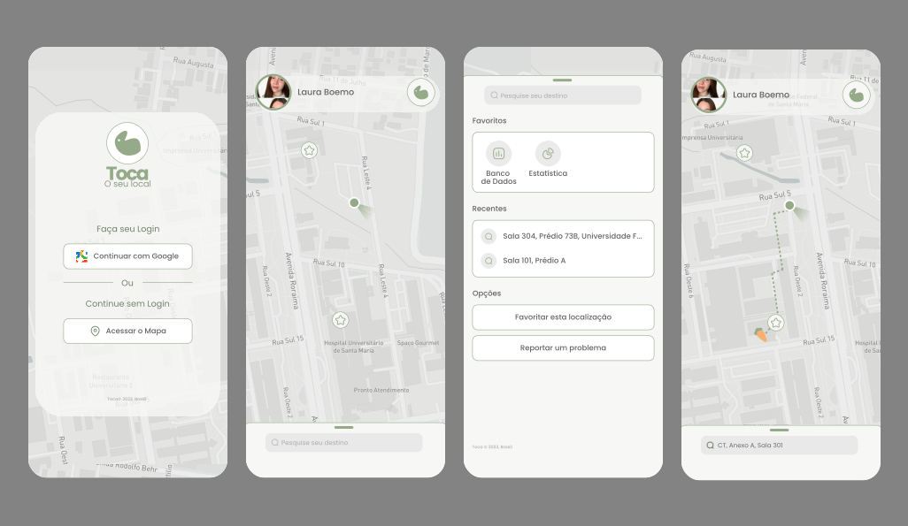

# Toca



## This Project

This project aims to enhance the spatial orientation of students at Federal Universities in Brazil. Given that classroom locations often don't follow a sequential order and aren't always accessible online, it can be challenging to locate them using traditional maps. To address this, the "Toca" app strives to provide the location of classrooms across all Brazilian teaching centers, integrating Google Maps with Next.js development.

## Getting Started

First, run the development server:

```bash
npm run dev
# or
yarn dev
# or
pnpm dev
# or
bun dev
```